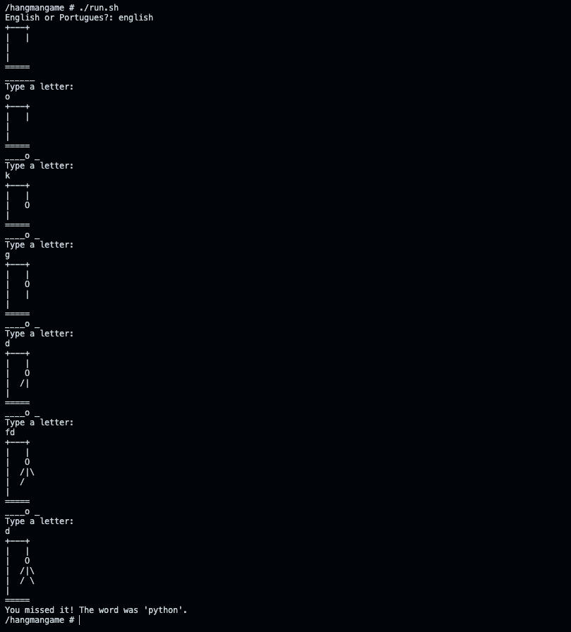
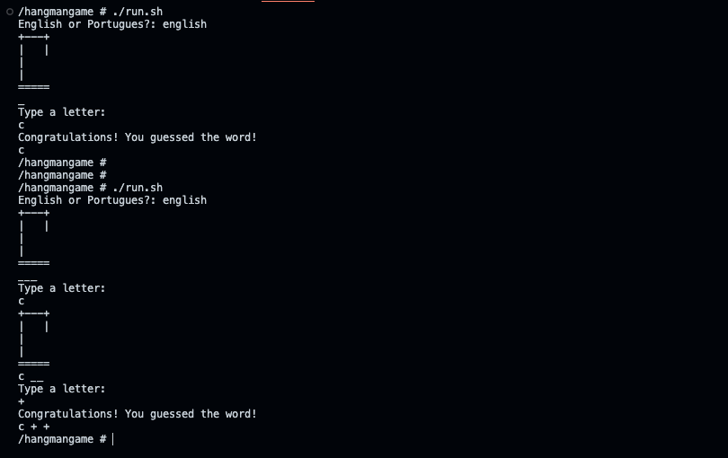
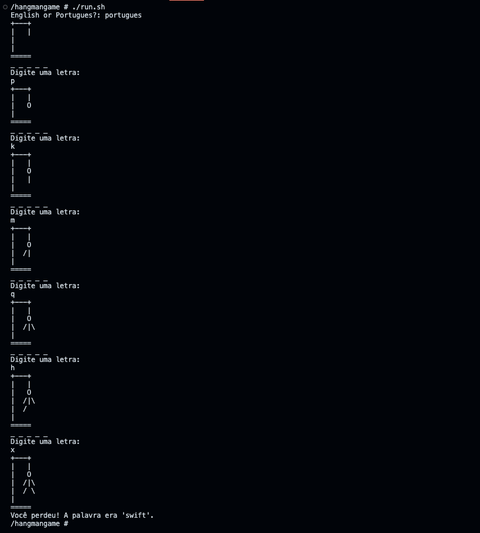
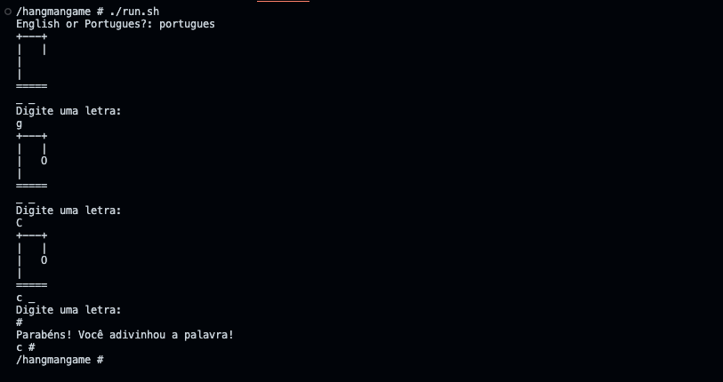

# **HangmanGame / Jogo da Forca**

**The Hangman class represents a game of hangman in Ruby, which aims to guess a word randomly chosen by the computer.**

## **Requirements**

- Ruby 3 or higher

## **Language**

- This game have two versions, one in English and another in Portuguese(pt-br)

## **Features**

- The game is played in the terminal
- Insite the class HangmanGame and JogoDaForca you can change the list of  the words in @word (us_en) or @palavra (pt_br) that will be used in the game

[./us_en/hangman_game.rb](./us_en/hangman_game.rb#L18)

```ruby
  def initialize
    @word = ['ruby', 'rails', 'javascript', 'python', 'java', 'c', 'c++',
             'c#', 'php', 'swift', 'kotlin', 'go', 'ruby on rails',
             'ruby on rails'].sample.downcase
    @wrong_letters = ''
    @correct_letters = []
    @end_of_game = false
  end
```

[./pt_br/jogo_da_forca.rb](./pt_br/jogo_da_forca.rb#L18)

```ruby
  def initialize
    @palavra = ['ruby', 'rails', 'javascript', 'python', 'java', 'c', 'c++',
                'c#', 'php', 'swift', 'kotlin', 'go', 'ruby on rails',
                'ruby on rails'].sample.downcase
    @letras_erradas = ''
    @letras_corretas = []
    @fim_de_jogo = false
  end
```

## **How to play**

- Clone the repository

- Run ./run.sh

```bash
git clone

cd HangmanGame

./run.sh
```

## **Screenshots**









## **License**

[MIT](./LICENSE)
